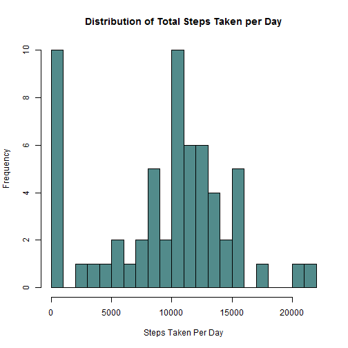
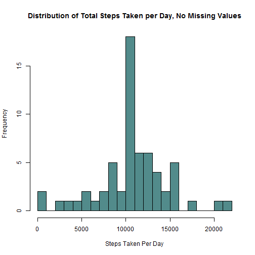

## Reproducible Research Course
## Peer Assessment 1

### Loading and preprocessing the data

Data set used for this analysis is stored in this repository as __activity.zip__. Download the data into your working directory. Now, unpack zip file using the code line below.


```r
unzip("repdata-data-activity.zip")
```

Load the data from the csv file using __read.csv__ function. Load the result into a data frame called __activityDF__

```r
activityDF <- read.csv("activity.csv", header=TRUE, sep=",")
```

Analysis of the data frame structure reveals that varibale "date" is a factor variable

```r
str(activityDF)
```

```
## 'data.frame':	17568 obs. of  3 variables:
##  $ steps   : int  NA NA NA NA NA NA NA NA NA NA ...
##  $ date    : Factor w/ 61 levels "2012-10-01","2012-10-02",..: 1 1 1 1 1 1 1 1 1 1 ...
##  $ interval: int  0 5 10 15 20 25 30 35 40 45 ...
```

Therefore, the "date" varibale needs to be tranformed into a date format using "lubridate" package

```r
library(lubridate)
activityDF$date <- ymd(activityDF$date)
```

Now, we can see that the "date" varibale is in POSIXct format

```r
str(activityDF)
```

```
## 'data.frame':	17568 obs. of  3 variables:
##  $ steps   : int  NA NA NA NA NA NA NA NA NA NA ...
##  $ date    : POSIXct, format: "2012-10-01" "2012-10-01" ...
##  $ interval: int  0 5 10 15 20 25 30 35 40 45 ...
```

### What is mean total number of steps taken per day?

In order to transform the data frame and find total number of steps per day load __plyr__ and __dplyr__ packages. Transform the __activityDF__ into a data frame tbl for a easier handling. Next, group the data by date using function __group_by__ and record results into data frame called __DF_by_date__. Finally, use __summarize__ function to sum all steps made on each date. Store results in a data frame __total_steps__. Note that the data set contains NA values. They should be ignored in this summary, hence na.rm attribute. A sample of the final data frame is available below.


```r
library(plyr)
library(dplyr)
activityDF <- tbl_df(activityDF)
DF_by_date <- group_by(activityDF, date)
total_steps <- summarize(DF_by_date, "steps per day" = sum(steps, na.rm=TRUE))
total_steps
```

```
## Source: local data frame [61 x 2]
## 
##          date steps per day
## 1  2012-10-01             0
## 2  2012-10-02           126
## 3  2012-10-03         11352
## 4  2012-10-04         12116
## 5  2012-10-05         13294
## 6  2012-10-06         15420
## 7  2012-10-07         11015
## 8  2012-10-08             0
## 9  2012-10-09         12811
## 10 2012-10-10          9900
## ..        ...           ...
```

Using the results recorded in __total_steps__ data frame, create a histogram. For this analysis, we chose to use 20 bins because of the spread of data.

```r
hist(total_steps$`steps per day`, breaks = 20, col = "darkslategray4",
     main = "Distribution of Total Steps Taken per Day",
     xlab = "Steps Taken Per Day")
```

 

Having examined the histogram, we can observe that there are 10 days when the number of steps taken was between 0 and 1000 or no values were recorded.

Find mean of the total number of steps taken per day:

```r
mean(total_steps$`steps per day`)
```

```
## [1] 9354.23
```

Find median of the total number of steps taken per day:

```r
median(total_steps$`steps per day`)
```

```
## [1] 10395
```

### What is the average daily activity pattern?

In order to obtain average number of steps per interval across all days, transform the data in a fashion similar to the case when we found total number of steps per day. This time, however, group the data from __activityDF__ by "interval", instead of "date". Store the summarized data in __avg_steps__ data frame. Use the line plot to graph average number of steps per interval.

```r
DF_by_interval <- group_by(activityDF, interval)
avg_steps <- summarize(DF_by_interval,
                       "avg steps per interval" = mean(steps, na.rm=TRUE))
plot(avg_steps$interval, avg_steps$`avg steps per interval`, type = "l",
     xlab = "Avg Number of Steps", ylab = "Interval",
     main = "Average Number of Steps Taken per 5-min Interval")
```

 

The 5-minute interval that contains the maximum number of steps on average across all the days in the dataset is:

```r
avg_steps$interval[which.max(avg_steps$`avg steps per interval`)]
```

```
## [1] 835
```

### Imputing missing values

Note that there in a number of days/intervals where there are missing values (coded as NA). The presence of missing days may introduce bias into some calculations or summaries of the data.

Total number of missing values in the original data set can be calculated as follows:

```r
sum(is.na(activityDF$steps))
```

```
## [1] 2304
```

In order to resolve the issue of missing values skewing the results of calculations, substitute NA values with average number of steps per interval that we calculated earlier and stored in __avg_steps__. Create a new data frame called __completeDF__ where the missing values will be filled by copying original __activityDF__ data frame. Replace NA vlaues in the "steps" variable of __completeDF__ with average number of steps associated with each interval.

```r
completeDF <- activityDF
na.steps <- which(is.na(completeDF$steps))
na.interval <- completeDF$interval[na.steps]
completeDF$steps[na.steps] <-
    avg_steps$`avg steps per interval`[match(na.interval, avg_steps$interval)]
```

Now, "steps" variable of the __completeDF__ does not contain any NA values:

```r
sum(is.na(completeDF$steps))
```

```
## [1] 0
```

Create a new histogram of the total number of steps taken each day. Note that there are no missing values in the data now. In order to do this, group and summarize __completeDF__ by date as done previously and create a histogram with 20 bins.

```r
completeDF_by_date <- group_by(completeDF, date)
complete_total_steps <- summarize(completeDF_by_date,
                                  "steps per day" = sum(steps))
hist(complete_total_steps$`steps per day`, breaks = 20, col = "darkslategray4",
     main = "Distribution of Total Steps Taken per Day, No Missing Values",
     xlab = "Steps Taken Per Day")
```

 

Mean:

```r
mean(complete_total_steps$`steps per day`)
```

```
## [1] 10766.19
```

Median:

```r
median(complete_total_steps$`steps per day`)
```

```
## [1] 10766.19
```

Previously, NA values resulted in 0 steps taken per day. Thus, results with values in the first bin (0 to 1000 steps) occurred with higher frequency. The likelihood that observation subject walks some amount of steps during those intervals where values are missing is close to average amount of steps per interval is higher than the likelihood of subject not walking at all. Therefore, subsituting missing values with average steps might give us more accurate results. Mean and median are also higher after imputing missing values due to the fact that there are fewer values close to 0 that would be pulling the results.

### Are there differences in activity patterns between weekdays and weekends?

Create a new factor variable in the dataset with two levels - "weekday" and "weekend" indicating whether a given date is a weekday or weekend day

```r
wdDF <- mutate(completeDF, "day of the week" =
                   ifelse(weekdays(completeDF$date, abbreviate = TRUE) %in%
                              c("Sat", "Sun"), "Weekend", "Weekday"))
```

Make a panel plot containing a time series plot of the 5-minute interval and the average number of steps taken, averaged across all weekday days or weekend days. Summarize the data by "day of the week" and "interval" and record results into the __avg_steps_by_wday__ data frame. Use this data frame to build a plot.

```r
groupedDF <- group_by(wdDF, `day of the week`, interval)
avg_steps_by_wday <- summarise(groupedDF, "steps per interval" = mean(steps))
layout(matrix(1:3, ncol = 1), widths = 1, heights = c(2,9,13), respect = FALSE)
par(mai=c(0,1,0,0))
plot.new()
par(mai=c(0.2,1,0.3,0))
plot(`steps per interval`~interval, data=avg_steps_by_wday,
     subset=(`day of the week`=="Weekday"), type="l", xlab = "",
     ylab="", xaxt="n", main="Weekdays")
par(mai=c(1.1,1,0.3,0))
plot(`steps per interval`~interval, data=avg_steps_by_wday,
     subset=(`day of the week`=="Weekend"), type="l",
     xlab="Interval", ylab = "", main="Weekends")
mtext("Avg Steps per Interval", side=2, at=200,line=2.5, cex = 0.7)
mtext(expression(bold("Activity Patterns: Weekdays v. Weekends")), cex=1.5, side=3, at=1200,line=22)
```

 
